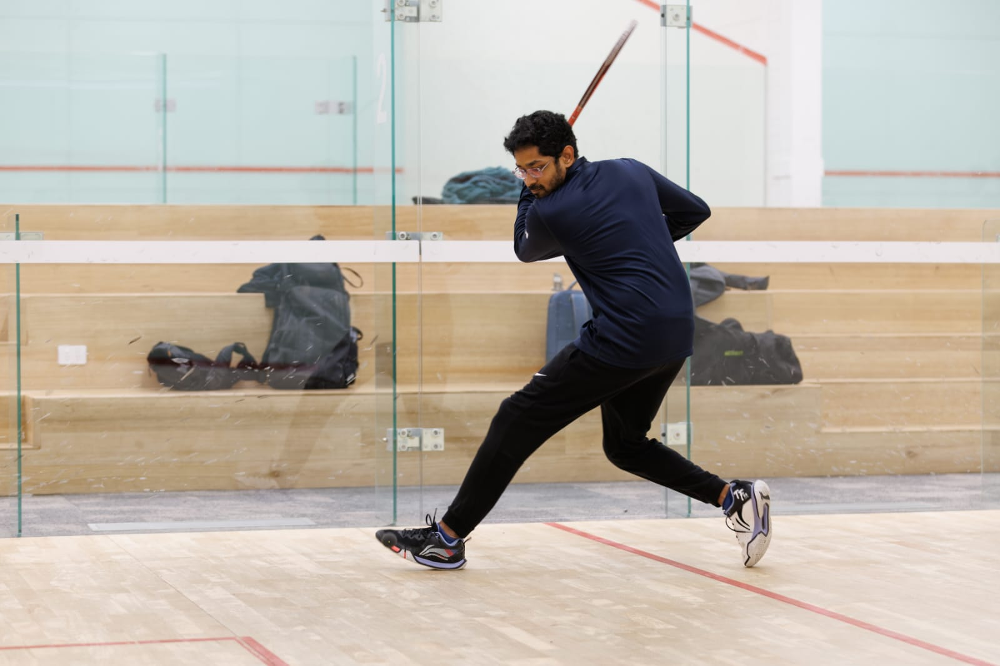
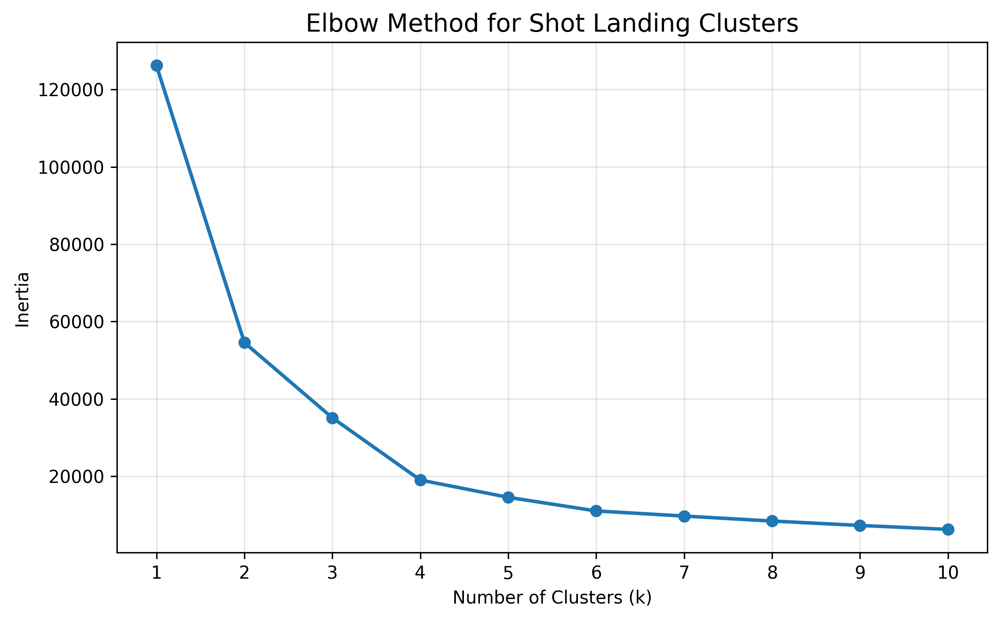
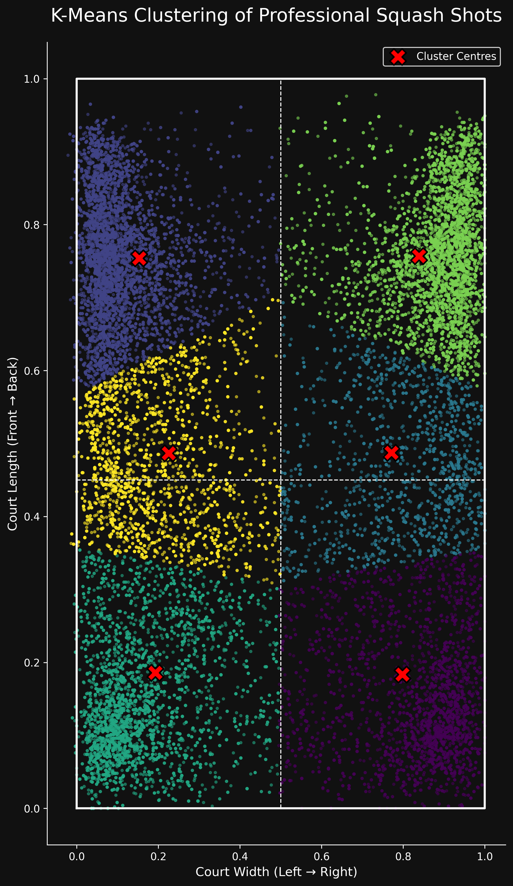

# Cross Court Analytics — Squash Performance

<table>
  <tr>
    <td width="35%" valign="top" align="center">

  

  </tr>
</table>

## Overview

This project began as a personal attempt to improve my squash performance through data analysis.

Two seasons ago, I lost 5 out of 6 matches in my squash league despite training consistently. Rather than relying only on coaching feedback, I wanted to understand what could be learnt from professional squash players at scale using match data.

I obtained professional squash rally datasets and built a series of analytical hypotheses exploring:

* shot selection
* rally structure
* positional behaviour
* movement patterns
* court control
* T-domination

The following season, after applying some of the insights from the analysis, I won 5 out of 8 matches.

This project evolved from a simple sports analytics exercise into a broader exploration of:

* probabilistic decision-making
* spatial analysis
* sequential behaviour
* positional pressure
* movement efficiency
* performance analytics

---

# Project Questions / Hypotheses

## Hypothesis 1

### Do certain shots from certain court positions contribute to rally-ending outcomes?

Key findings:

* Shot selection was not spatially random.
* Drives disproportionately preserved same-side structure.
* Boasts disproportionately disrupted structure and forced directional change.
* Most rallies — including many rally-ending shots — originated from the backcourt.

Main insight:
Professional squash rallies are highly structured and positionally constrained.

---

## Hypothesis 2

### Is the rally won by the final shot, or by the sequence leading up to it?

Key findings:

* Rally-ending shots alone had limited explanatory power.
* Pressure was built progressively through rally structure and positioning.
* Total movement forced on opponents showed weak predictive power for rally outcomes.
* Movement quality and recovery efficiency appeared more important than movement quantity alone.

Main insight:
Points are often constructed through positional pressure over multiple shots rather than isolated winners.

---

## Hypothesis 3

### Do left-handed players show different positional shot patterns?

Key findings:

* Left-handed player patterns appeared less structured than broader player populations.
* Some positional tendencies weakened when isolating left-handed players.
* Variability and unpredictability appeared higher within left-handed subsets.

Main insight:
Different player populations may not follow identical positional structures, highlighting the importance of adaptability and contextual analysis.

---

## Hypothesis 4

### How does T-domination contribute to rally and match outcomes?

Status:
In progress.

Current focus areas:

* Euclidean distance from T-position
* Recovery efficiency
* Positional control
* Pressure accumulation
* Rally construction patterns

---

# Dataset

The project uses professional squash rally datasets containing:

* shot-by-shot positional coordinates
* rally sequences
* player movement
* shot classifications
* rally outcomes

Key variables include:

* shot origin coordinates
* shot destination coordinates
* rally winner
* shot type
* player/team identifiers
* timestamp sequencing
* positional quadrants

---

# Variables / Data Dictionary

| Variable         | Description                                                                                                       |
| ---------------- | ----------------------------------------------------------------------------------------------------------------- |
| `match_id`       | Unique identifier for each match. Generated as `<event>_<date>_<playerA>_vs_<playerB>` or based on JSON filename. |
| `playerA`        | The first player (`team 0`) listed in the dataset — usually the primary or home player.                           |
| `playerB`        | The second player (`team 1`) listed in the dataset — opponent of playerA.                                         |
| `event`          | Tournament or competition name.                                                                                   |
| `date`           | Match date converted to ISO format (`YYYY-MM-DD`).                                                                |
| `game_no`        | Game number within the match (`1–5`).                                                                             |
| `rally_no`       | Sequential rally number within each game.                                                                         |
| `teamAScore`     | Player A’s score at that rally stage.                                                                             |
| `teamBScore`     | Player B’s score at that rally stage.                                                                             |
| `winner`         | Rally winner (`0 = playerA`, `1 = playerB`).                                                                      |
| `winMethod`      | How the rally ended.                                                                                              |
| `finalPositionX` | Normalised horizontal coordinate (`0–1`) of where the rally ended. `0 = left wall`, `1 = right wall`.             |
| `finalPositionY` | Normalised vertical coordinate (`0–1`) of where the rally ended. `0 = front wall`, `1 = back wall`.               |
| `shot_idx`       | Sequence number of the shot within the rally.                                                                     |
| `team`           | Player who hit the shot (`0 = playerA`, `1 = playerB`).                                                           |
| `timestamp`      | Video tracking timestamp (seconds or milliseconds).                                                               |
| `x`              | Normalised horizontal coordinate (`0–1`) where the shot was hit from. `0 = left wall`, `1 = right wall`.          |
| `y`              | Normalised vertical coordinate (`0–1`) where the shot was hit from. `0 = front wall`, `1 = back wall`.            |
| `shot_type`      | Derived shot classification (e.g. Volley, Boast, Lift, Drive). Represents the type of shot played.                |

## Coordinate Convention

The dataset uses normalised squash court coordinates:

* `x-axis`

  * `0 = left wall`
  * `1 = right wall`

* `y-axis`

  * `0 = front wall`
  * `1 = back wall`

This coordinate system was used throughout the clustering, movement, and positional analyses.

# Analytical Methods

Techniques used throughout the project include:

* Python
* Pandas
* NumPy
* Matplotlib
* K-Means Clustering
* Chi-Square Tests
* Spatial Analysis
* Sequential Pattern Analysis
* Positional Clustering
* Euclidean Distance Modelling

---

# Repository Structure

* `Combined_match_data.py`

  * Combines raw JSON match files into structured datasets

* `Hypothesis_1.py`

  * Shot type & positional relationship analysis

* `Hypothesis_2.py`

  * Rally sequence and pressure-building analysis

* `Hypothesis_2c.py`

  * Opponent movement and forced movement modelling

* `Hypothesis_2d.py`

  * Movement quality and positional disruption analysis

* `Hypothesis_3.py`

  * Left-handed player pattern analysis

* `Hypothesis_3a.py / 3b.py / 3c.py`

  * Advanced clustering and positional structure experiments

* `Hypothesis_4.py`

  * T-domination and positional control analysis

* `Plots.py`

  * Data visualisations and cluster plots

---

# Key Takeaways

This project changed how I think about both squash and analytical problem-solving.

The most important lesson was that:

* complex outcomes are rarely explained by one variable alone.

The analysis repeatedly showed that:

* positioning
* recovery
* pressure accumulation
* spatial structure
* movement timing

were often more important than isolated “winning shots.”

---

# Future Directions

Planned future work includes:

* T-domination modelling
* Rally momentum analysis
* Recovery-time estimation
* Sequence prediction models
* Shot-transition networks
* Match-level positional dominance metrics

---

# Disclaimer

This repository is intended for educational and analytical purposes only.

Raw proprietary datasets are not redistributed in this repository unless explicitly permitted.

---

# Author

Pranav Shankaran

* LinkedIn: [www.linkedin.com/in/pranav-shankaran-data-analyst/](http://www.linkedin.com/in/pranav-shankaran-data-analyst/)
* GitHub: https://github.com/Psha0077
